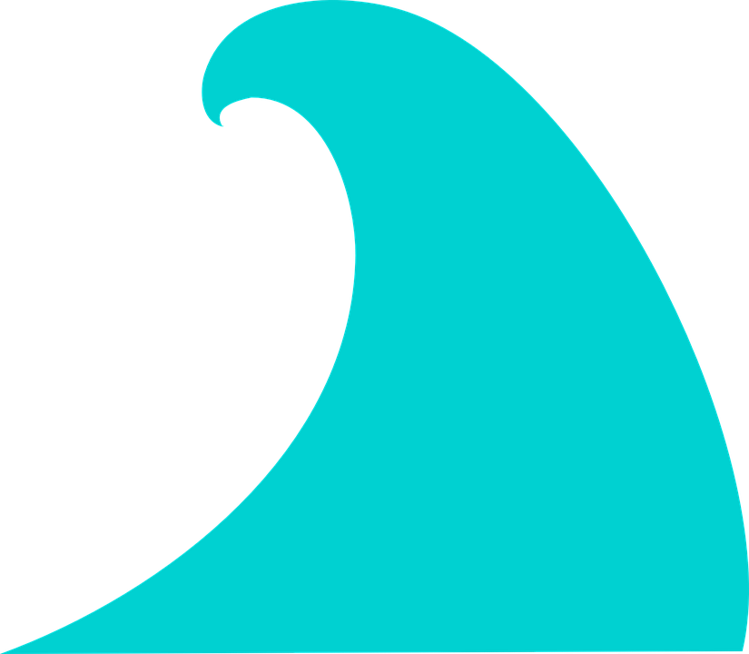

# It´s Surf Time

## Introduction


The elite of world surfing are faced each year in autumn on the south coast of the Landes to play the ninth stage of the world championships of surr, the Quiksilver Pro France. 

In 2019, ***the WSL*** (World Surf League) has been planned from October 3 to 13. That is, 11 days to see the best surfers in the world face in the waves of the Landes. During this same period, we will also be able to witness the female stage of the World Surfing Championships, the Roxy Pro France.

## Play and Imagine

Imagine that you have spent a lot of time preparing for this global event held every year in Hossegor.
Only the best surfers will be gaining position and although reaching the goal is difficult, here we come to play! So good luck and win!

## How to play

- You will start with 3 lives.
- Handle with the arrow icons of the computer keyboard.
- Surf the wave length to get points.
- Do not get off the track.
- Sharks take lives.
- Do not exceed the time limit.

```
	I know you're a good surfer and you'll dodge sharks!
```


## Step by Step ..img/shark.png


First, **TRAIN.** The morning of Saturday will be training.

You can enjoy a **LUNCH** at 12:30 hours to recharge energies.

16:00 hours will start the most important **COMPETITION** in the world of surfing.
It will begin with **SOFT WAVES.**

Only the best will pass to the rest of the tests.

**GREATER SURROGANCE** and with **GREATER STRENGTH** as you reach the final test.


**List of things we can not forget :**
```html
<ul>
  <li>Good load of fun</li>
  <li>Good load of friendship</li>
  <li>Good load of enjoyment</li>
  <li>Good load of force</li>
  <li>Good load of positivism</li>
  <li>Good load of energy</li>
</ul>
```


Among the winners of the **WSL** of all these years, we can see that some legends of surfing have been proclaimed champions on several occasions, as is the case of: Kelly Slater, world champion of surfing on 11 occasions and best suffist of all time; Mark Richards, who managed to win the first place 4 consecutive times; Tom Curren, Andy Irons and Mick Fanning winners on 3 occasions of the championship; or Tom Carroll and Damien Hardman who did it 2 times.

The Basque Garazi Sánchez Ortún is once again among the 50 best surfers in the world,occupying the 35th place. On the other hand, Ainara Aymat, Ariana Ochoa and Lucía Martino are among the top 100, ranked 67, 83 and 94 respectively , out of a total of 363 participants.

```
Thank you very much everyone for participating and congratulations for coming here!!!
GOOD LUCK EVERYONE 
```
